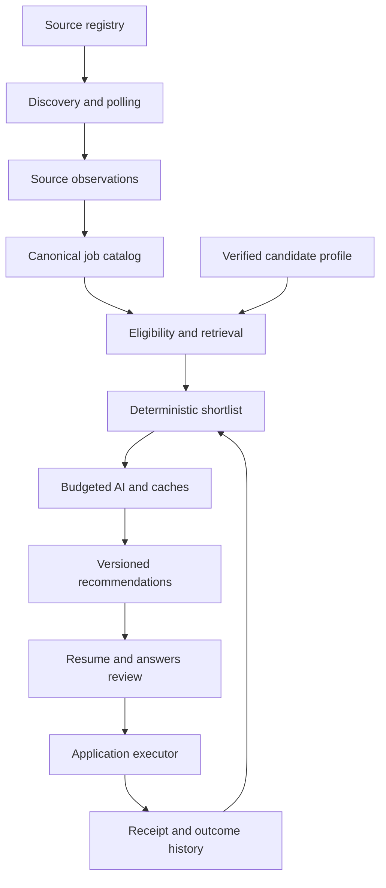
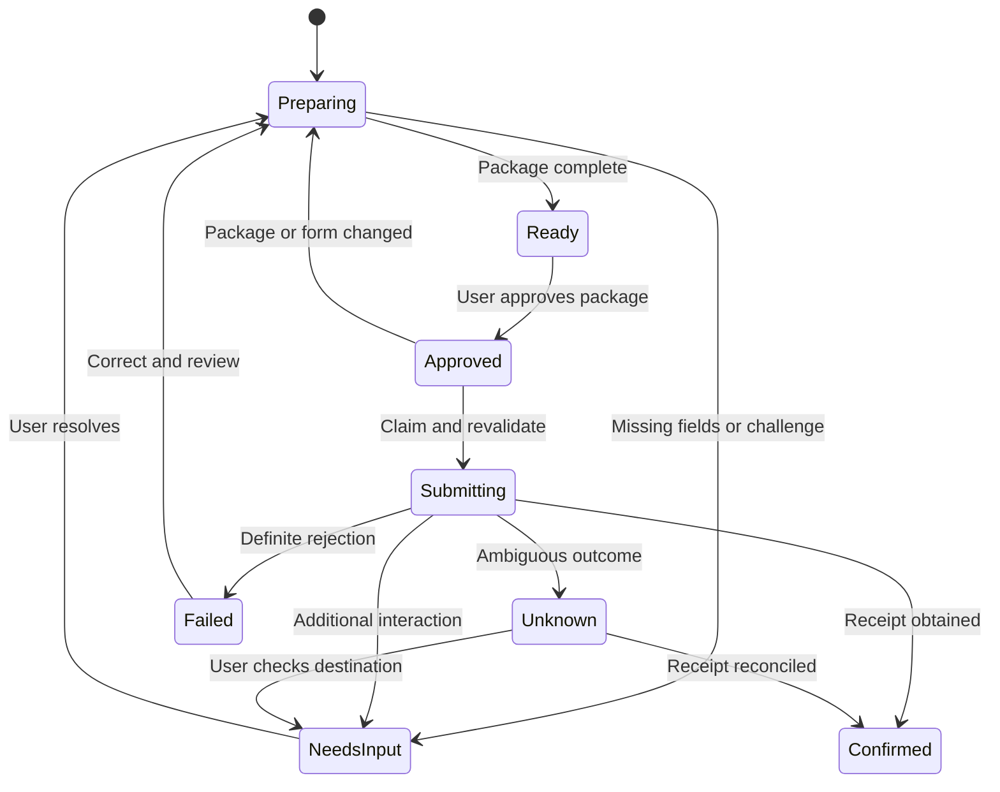

# ApplyForge: architecture review and upgrade design

Reviewed **2026-09-13**, against `main` commit [`f0e5ee3fcbc08cbaa4a2bba166c7eb78c281017e`](https://github.com/lalith-99/applyforge/commit/f0e5ee3fcbc08cbaa4a2bba166c7eb78c281017e).

**Recommendation:** retain Next.js, the Go modular backend, Python for AI/documents, PostgreSQL/pgvector, and S3-compatible storage. Improve source identity and data quality, make AI incremental and budgeted, and add a separate application execution workflow. Increasing scraper volume or choosing a larger model will not fix the current information loss and lifecycle errors.

This is a code-backed review and an implementation design. Four bounded fixes accompany it: complete Lever descriptions and location metadata; independent lexical retrieval capacity; transactional recommendation replacement; removal of the active hardcoded development-company bootstrap. **The proposed budget gateway, source-membership migration, freshness migration, and automatic submission engine are not implemented by this change.**

## 1. Scope, evidence, and product contract

Traced source discovery, connectors, ingestion/upsert/closure, SQL retrieval, deterministic matching, AI ranking, recommendation refresh and publication, AI provider/usage recording, queue leases, resume approval/version generation, application endpoints, web application/tailoring flows, migrations, and CI. File references below point to the reviewed commit so they remain valid after fixes.

The review did not connect to the user's running Docker database, use their AI key, crawl thousands of employers, or submit real applications. Catalog counts, source yield, dollar savings, and application success rates are therefore **not live measurements**. Existing tests establish only their tested behavior; they do not establish nationwide job coverage or hiring outcomes.

The intended personal-use product contract is:

- U.S. software individual-contributor roles, including Java/full-stack/Go/frontend/backend/DevOps/platform roles; exclude internships, management, QA/tester and analyst roles according to explicit preferences.
- Full-time eligibility and immigration requirements must be represented explicitly. Historical employer sponsorship is evidence, not a guarantee for an individual opening. A posting's explicit incompatibility overrides positive historical signals.
- “Posted in the last 24 hours” must mean evidence of publication in that window. Newly discovered and recently edited postings are useful but must have different labels.
- Maintain broad employer coverage, including consulting and mid-market employers. Prioritize 10–20 worthwhile daily recommendations; do not pad the shortlist with weak or incompatible jobs.
- Show the exact resume and application answers that will be transmitted. User approval authorizes only that job and that immutable package.

### What is already good

The repository already has eight direct ATS implementations (Greenhouse, Lever, Ashby, SmartRecruiters, Workable, Workday, iCIMS, SuccessFactors), structured career-page ingestion, optional broad providers, a source registry, sponsor prioritization, canonical links, role/location normalization, deterministic scoring, hybrid retrieval, company diversity, structured AI output, heuristic fallbacks, usage records, and a PostgreSQL queue. Recent commits added source-sync uniqueness, stale lease recovery, interactive queue priority, iCIMS tenant namespacing, and improved country filtering. These should be preserved.

The Python service is an HTTP service called by Go workers; it is not independently consuming the PostgreSQL queue. Several older architecture documents describe otherwise.

## 2. Findings, ranked by impact

P1 means fix before expanding unattended workloads or releasing submission; P2 means the next quality/operability iteration. “Confirmed” describes a code path or missing contract; where runtime impact depends on data or timing, that condition is stated.

| ID | Priority | Finding and consequence | Evidence at reviewed commit | Disposition |
|---|---|---|---|---|
| F01 | P1 | **Greenhouse update time is stored as publication time.** Editing an old posting can put it in the last-24-hour catalog and trigger eager AI. The existing connector test endorses this mapping. | [greenhouse.go:70](https://github.com/lalith-99/applyforge/blob/f0e5ee3/apps/api/internal/jobs/greenhouse.go#L70) | Confirmed; freshness migration required. |
| F02 | P1 | **Closure is scoped to provider type + company, not source/tenant.** When one company has two boards on the same ATS, completing one board's poll can close jobs from the other. The bootstrap explicitly permits multiple boards per company. | [closure SQL:103](https://github.com/lalith-99/applyforge/blob/f0e5ee3/apps/api/internal/database/queries/jobs.sql#L103), [bootstrap](https://github.com/lalith-99/applyforge/blob/f0e5ee3/apps/api/internal/jobs/free_source_bootstrap.go#L247) | Confirmed scope mismatch; source-membership design below. |
| F03 | P1 | **Partial persistence can still lead to closure and a successful poll.** Snapshot-touch failures are logged; per-job upsert failures continue; ingestion can then close unseen rows and return success. A transient database error can look like an employer removing a job. | [ingest.go:61](https://github.com/lalith-99/applyforge/blob/f0e5ee3/apps/api/internal/jobs/ingest.go#L61), [upsert:151](https://github.com/lalith-99/applyforge/blob/f0e5ee3/apps/api/internal/jobs/ingest.go#L151), [closure:245](https://github.com/lalith-99/applyforge/blob/f0e5ee3/apps/api/internal/jobs/ingest.go#L245) | Confirmed error-handling flaw. |
| F04 | P1 | **Lever loses qualifications, responsibilities, and closing disclosures.** Only `descriptionPlain` is kept; `lists` and `additionalPlain` may contain both critical skills and sponsorship exclusions. Country/workplace metadata is also dropped. | [lever.go:40](https://github.com/lalith-99/applyforge/blob/f0e5ee3/apps/api/internal/jobs/lever.go#L40) | Fixed in this change; regression fixtures added. |
| F05 | P1 | **A full semantic pool starves exact lexical terms.** The standard 80-result recommendation run requests 800 semantic candidates, while a combined 700-candidate stopping condition can end lexical retrieval after the first result of the first term. Later Java/Go/full-stack queries never run. | [matching/service.go:328](https://github.com/lalith-99/applyforge/blob/f0e5ee3/apps/api/internal/matching/service.go#L328) | Fixed: lexical capacity is independently bounded by 12 terms × 40 results. |
| F06 | P1 | **Local startup resurrects a fixed company list.** Non-production startup calls a method containing 36 hardcoded companies and board tokens, recreating the supply bias previously intended to be removed. | [main.go:158](https://github.com/lalith-99/applyforge/blob/f0e5ee3/apps/api/cmd/api/main.go#L158), [repository.go:628](https://github.com/lalith-99/applyforge/blob/f0e5ee3/apps/api/internal/jobs/repository.go#L628) | Startup call and hardcoded method removed. Existing database records are not destructively deleted. |
| F07 | P1 | **Historical H-1B evidence is an early mandatory retrieval gate.** A relevant posting explicitly supporting transfer can be discarded before parsing if its company has no matched recent DOL record. Historical evidence is cached efficiently, but the predicate is still too restrictive for this case. | [matching/service.go:272](https://github.com/lalith-99/applyforge/blob/f0e5ee3/apps/api/internal/matching/service.go#L272), [retrieval SQL](https://github.com/lalith-99/applyforge/blob/f0e5ee3/apps/api/internal/database/queries/jobs.sql#L202) | Confirmed; add explicit-positive posting evidence alongside history, with denial precedence. |
| F08 | P1 | **Full-time filters accept missing employment type.** Both SQL and eligibility treat unknown type as acceptable. This improves recall but does not satisfy a strict full-time-only product promise. | [jobs.sql:122](https://github.com/lalith-99/applyforge/blob/f0e5ee3/apps/api/internal/database/queries/jobs.sql#L122), [eligibility.go](https://github.com/lalith-99/applyforge/blob/f0e5ee3/apps/api/internal/matching/eligibility.go) | Confirmed; retain unknown inventory, require verification for strict shortlist/submission. |
| F09 | P1 | **Recommendation replacement is not atomic despite its comment.** DELETE and individual INSERTs use pool-bound queries without a transaction. Failure exposes an empty/partial set; concurrent refreshes can collide. | [jobrecommendations/repository.go:58](https://github.com/lalith-99/applyforge/blob/f0e5ee3/apps/api/internal/jobrecommendations/repository.go#L58) | Fixed with one transaction and a per-user row lock; rollback regression added. Version-order fencing remains future work. |
| F10 | P1 | **Hourly ranking spends again on unchanged candidate/job pairs.** Eighty jobs are sent in four 20-job calls each refresh; materializing recommendations saves read cost but does not cache judgments. Catalog events can add more refreshes. | [airank/service.go:58](https://github.com/lalith-99/applyforge/blob/f0e5ee3/apps/api/internal/airank/service.go#L58), [main.go:503](https://github.com/lalith-99/applyforge/blob/f0e5ee3/apps/api/cmd/api/main.go#L503) | Confirmed; durable semantic-input cache and incremental recomputation needed. |
| F11 | P1 | **There is accounting, but no enforced AI spend budget.** One input/output price pair is used for all model overrides, default prices are blank, and each usage record overwrites the previous call in thread-local state. Multi-call routes, failures, cache reads/writes and retries are not fully costed. | [openai_provider.py:83](https://github.com/lalith-99/applyforge/blob/f0e5ee3/apps/ai-worker/app/providers/openai_provider.py#L83), [aiusage.go](https://github.com/lalith-99/applyforge/blob/f0e5ee3/apps/api/internal/aiusage/aiusage.go), [compose](https://github.com/lalith-99/applyforge/blob/f0e5ee3/docker-compose.yml#L82) | Confirmed; per-model prices, per-attempt accounting and atomic budget reservations required. |
| F12 | P1 | **AI work is broader and less idempotent than necessary.** Eager parsing covers dated U.S. software jobs up to 30 days old, including duplicates/denied jobs; embedding workers do not verify an embedding content hash or model before a call. A stale worker can write results after a posting changes. | [ingest.go:213](https://github.com/lalith-99/applyforge/blob/f0e5ee3/apps/api/internal/jobs/ingest.go#L213), [embed_worker.go:53](https://github.com/lalith-99/applyforge/blob/f0e5ee3/apps/api/internal/jobs/embed_worker.go#L53) | Confirmed; gate by canonical relevance and compare-and-set versioned results. |
| F13 | P2 | **Fallback output is not represented as a distinct quality state.** Heuristic ranking returns HTTP 200 and Go sets `HasJudgment=true`; an unavailable model can therefore become an “AI” assessment. Requirement-cache identity omits model/provenance, so a fallback can remain cached after AI recovers. | [candidates.py](https://github.com/lalith-99/applyforge/blob/f0e5ee3/apps/ai-worker/app/api/candidates.py), [airank:107](https://github.com/lalith-99/applyforge/blob/f0e5ee3/apps/api/internal/airank/service.go#L107), [requirements cache](https://github.com/lalith-99/applyforge/blob/f0e5ee3/apps/api/internal/jobrequirements/service.go#L35) | Confirmed; expose `AI`, `RULES`, `CACHED`, `DEFERRED`, with confidence and bounded re-enrichment. |
| F14 | P1 | **Application submission does not exist.** Routes save/update application records and reusable answers; the web board advances statuses. There is no browser runner, ATS write adapter, submission intent, receipt, or uncertain-outcome reconciliation. | [application routes](https://github.com/lalith-99/applyforge/blob/f0e5ee3/apps/api/internal/applications/handlers.go#L25), [web board](https://github.com/lalith-99/applyforge/blob/f0e5ee3/apps/web/app/applications/page.tsx#L198) | Confirmed capability gap; execution design in section 7. |
| F15 | P1 | **Resume approval is not a submission authorization.** Attestation is checked at the suggestion endpoint but its boolean is not passed into persisted approval evidence. Application save accepts a supplied resume-version ID without a user/job ownership check in that service. Version generation checks owner of the run but not equality of run resume/job to the requested resume/job. | [tailoring handler:166](https://github.com/lalith-99/applyforge/blob/f0e5ee3/apps/api/internal/tailoring/handlers.go#L166), [Save:28](https://github.com/lalith-99/applyforge/blob/f0e5ee3/apps/api/internal/applications/service.go#L28), [GenerateVersion](https://github.com/lalith-99/applyforge/blob/f0e5ee3/apps/api/internal/resumeversion/service.go#L65) | Confirmed validation gaps; immutable package and durable scoped approval required before sending. No cross-user data retrieval exploit was attempted. |
| F16 | P1 | **Application status and audit event can disagree.** Status UPDATE commits before event creation; a failed event leaves a changed status with an error response. Concurrent transitions can record the wrong prior status. | [applications/service.go:44](https://github.com/lalith-99/applyforge/blob/f0e5ee3/apps/api/internal/applications/service.go#L44) | Confirmed; one locked transaction, separate manual and confirmed submission events. |
| F17 | P1 | **Queue lease recovery lacks fencing for irreversible work.** Two-hour recovery exists, but completion/failure writes use job ID without a claim generation. A slow original worker can still finish after a replacement claim. Only source-sync tasks have the race-safe active-task uniqueness index. | [background_jobs.sql](https://github.com/lalith-99/applyforge/blob/f0e5ee3/apps/api/internal/database/queries/background_jobs.sql#L48), [migration 64](https://github.com/lalith-99/applyforge/blob/f0e5ee3/apps/api/internal/database/migrations/00064_background_queue_reliability.sql) | Confirmed contract gap; lease generations and domain idempotency are prerequisites for automated submission. |
| F18 | P2 | **Canonical identity and lifecycle are coupled to one source row.** Fingerprints require identical normalized descriptions/location; broad feeds often abbreviate them. Dedupe is principally performed on insertion. If the chosen canonical later closes while a linked source remains active, ordinary re-polling does not necessarily promote the surviving source. | [fingerprint](https://github.com/lalith-99/applyforge/blob/f0e5ee3/apps/api/internal/jobs/normalize.go#L416), [ingest:184](https://github.com/lalith-99/applyforge/blob/f0e5ee3/apps/api/internal/jobs/ingest.go#L184) | Confirmed design exposure; magnitude depends on overlapping feeds. Canonical jobs must outlive individual source observations. |
| F19 | P2 | **Ranking lacks complete evidence and empirical calibration.** AI receives skill lists and a summary, not selected JD responsibility/evidence spans. Its `interview_probability_score` is a generated score, not a probability trained/calibrated on outcomes. | [ranking input](https://github.com/lalith-99/applyforge/blob/f0e5ee3/apps/api/internal/airank/service.go#L124), [ranking prompt](https://github.com/lalith-99/applyforge/blob/f0e5ee3/apps/ai-worker/app/candidates/ranking.py) | Confirmed; use evidence-backed fit and remove probability language until validated. |
| F20 | P2 | **Hydration and read-model gaps reduce supply or reuse stale eligibility.** SmartRecruiters hydrates only already-classified software titles, leaving ambiguous titles without text for classification; one detail failure aborts the full fetch. Recommendation reads recheck some hard filters but not all updated employment/exclusion preferences or prior application status. | [smartrecruiters.go:104](https://github.com/lalith-99/applyforge/blob/f0e5ee3/apps/api/internal/jobs/smartrecruiters.go#L104), [recommendation read SQL](https://github.com/lalith-99/applyforge/blob/f0e5ee3/apps/api/internal/database/queries/job_recommendations.sql) | Confirmed; split listing/detail work and version/revalidate eligibility. |

Other follow-ups: repeated missing-contact recovery can reparse a resume at document generation; version numbering/document creation is a multi-step process without a ready/failed lifecycle; shared worker slots can all be occupied by long source/AI operations despite queue priority; requirements parsing is serial across the retrieved pool; offset pagination and repeated COUNT queries need measurement before larger catalogs; Python dependency ranges are unbounded. These are secondary to the correctness and cost gates above.

## 3. Target architecture

Keep one deployable Go codebase, with separately configurable worker classes. PostgreSQL remains sufficient until measurements show otherwise. Add a local browser companion/extension for application execution; avoid introducing Kafka, Kubernetes or a new vector database for this personal MVP.



The AI service proposes structured content. Go owns eligibility, identity, budget authorization, artifact versions, approval, execution state and side effects. Untrusted descriptions and web pages never issue instructions to the submission engine.

## 4. Job supply: maximize relevant coverage without uncontrolled crawling

### 4.1 Source graph and discovery

Use the sponsor dataset and source registry to prioritize discovery, not to define the complete universe of jobs. Ingest broad discovery results to learn authoritative apply URLs and employer identities; then poll verified employer sources directly. Maintain legal-employer aliases separately from brands and subsidiaries. Do not automatically equate every prefix match with the same sponsoring entity.

Keep explicit job-level sponsorship positives even when historical company matching fails. For a user requiring transfer, retrieval should admit `explicit_positive OR credible_recent_history`, exclude `explicit_denial`, and route ambiguous cases according to the configured uncertainty preference. Transfer, new cap sponsorship and future sponsorship are separate evidence types. Do not label general visa wording as a guaranteed transfer offer.

Choose the next connector by unresolved employer coverage and observed relevant yield. For consulting/enterprise coverage, prioritize the existing Workday, SmartRecruiters, iCIMS and SuccessFactors implementations, then add missing vendors from the registry's largest relevant gaps. Do not assume vendor names alone guarantee useful inventory.

| Channel | Role in the system | Operating rule |
|---|---|---|
| Employer ATS listing feeds | Default recurring supply | Incremental discovery; stable IDs; complete-snapshot validation; conditional GET where supported. |
| Employer structured career pages | Fill direct-source gaps | Parse validated `JobPosting` metadata; bounded detail fetches; preserve evidence URLs. |
| Licensed broad providers/search | Discover missing jobs and career endpoints | Track unique eligible additions per dollar; dedupe before AI; explicit monthly quota. |
| User-pasted job links | High-intent gap coverage | Resolve to the official application destination and perform the same eligibility checks. |
| Unsupported/blocked portals | Preserve discovery knowledge | Registry-only or manual handoff until a permitted integration exists. |

Public ATS read access is not employer write authorization. Greenhouse documents unauthenticated GETs but authenticated submission; Lever documents a required account API key for POST; Ashby submission requires `candidatesWrite`. [Greenhouse](https://docs.greenhouse.io/job-board.html), [Lever](https://github.com/lever/postings-api), [Ashby](https://developers.ashbyhq.com/reference/applicationformsubmit).

Do not build coverage around automated LinkedIn account scraping or auto-applying through its interface: LinkedIn prohibits specified automation and extensions. Use permitted access/partner feeds and link to employer applications. [LinkedIn's published restrictions](https://www.linkedin.com/help/linkedin/answer/a1341387/prohibited-software-and-extensions).

### 4.2 Separate job identity from source observations

Implementation status: migration `00066_source_scoped_job_lifecycle.sql` ships the first safe transition.
It adds concrete `job_source_postings` membership, monotonically increasing poll generations, atomic
source-scoped closure, partial-persistence failure semantics and an anomalous-empty-snapshot guard. It
conservatively backfills only unambiguous legacy rows. Stable canonical jobs, staged poll-seen IDs and
field-level evidence remain follow-up work.

Target schema:

| Entity | Key and minimum fields | Purpose |
|---|---|---|
| `source_postings` | Unique `(source_id, external_id)`; `canonical_job_id`; raw hash/blob reference; first/last seen; source publication/update times; lifecycle; detail status | Preserve each tenant's identity and provenance. |
| `source_poll_runs` | Source ID; generation; started/completed; complete listing flag; pagination evidence; fetched/persisted counts; error status | Make closure depend on a successful, complete snapshot. Extend existing poll tracking. |
| `source_poll_seen` | Unique `(poll_run_id, external_id)` | Stage the complete seen set independently of detail hydration. |
| `jobs` | Stable canonical ID; best current fields; canonical revision; evidence references | Remain stable when a provider stops listing the posting. |
| `job_locations` | `(job_id, normalized_location)` plus country, work arrangement, eligibility scope | Represent multiple locations and country-restricted remote work correctly. |
| `job_field_evidence` | Job/field/value/source/confidence/extraction version/observed time | Audit dates, employment type and sponsorship. |

Poll algorithm: acquire a source lease → enumerate all IDs into staging → persist observations → mark the snapshot complete → atomically update that source's membership. Close only missing memberships from **that source ID**, never sibling tenants. A canonical job stays active while credible active memberships remain. Promotion also occurs on closure/reopening, not only insertion. Use a poll generation to prevent an older poll finalizing after a newer one.

On listing/page/storage failure, retain prior active inventory and mark the poll partial/failed. Detail failures produce independently retryable detail tasks; they must not erase listing membership. An anomalous empty result should be checked against provider semantics and prior volume before mass closure.

Identity order: verified employer + ATS tenant + native requisition ID; canonicalized official apply URL; then conservative title/location/description similarity. Avoid collapsing two real requisitions merely because their title and description match. Keep uncertain clusters separate and measure duplicate rate.

### 4.3 Freshness must retain meaning

Add `published_at`, `source_updated_at`, `first_seen_at`, `date_kind`, `date_precision`, `date_source` and, for approximate timestamps, an uncertainty interval. Store date-only values as date precision, not falsely precise UTC midnight.

- Confirmed recent: trustworthy publication evidence within the selected window.
- Newly discovered: first seen recently, publication unknown.
- Recently updated: source says changed recently, original publication may be old.

The strict last-24-hour view includes only publication evidence that satisfies its policy. Unknown/updated inventory remains accessible separately. If provider metadata exposes a trustworthy original `datePosted`, use it and retain its source. Google's JobPosting documentation distinguishes `datePosted` as the original posting date. [Google JobPosting specification](https://developers.google.com/search/docs/appearance/structured-data/job-posting).

Migrate existing Greenhouse timestamps by preserving their known meaning as update timestamps; do not silently treat them as verified publication. Backfill original dates only from evidence. Expect honest “posted 24h” counts to decrease initially; measure newly discovered supply separately rather than restoring incorrect dates.

### 4.4 Poll adaptively and enforce fairness

Start with existing sponsor tiers, then tune using eligible yield, source latency and error history. As an initial design hypothesis: productive high-priority boards every 30–60 minutes, medium yield every 4 hours, cold/unresolved sources daily. Enforce provider/host token buckets, Retry-After, exponential backoff with jitter, per-tenant concurrency, response-size limits and request deadlines. These are proposed cadences, not claims about provider quotas.

Separate listing polls, detail hydration and AI queues; reserve at least one worker slot for interactive tasks. Deduplicate queued work by entity + content/prompt revision. Do not let bulk onboarding of 10,000 sources monopolize resume review.

Measure: monitored employers; successful polling coverage; fresh canonical U.S. software jobs; verified full-time and immigration-compatible subset; unique employers; detail/valid-date coverage; queue age; dedupe rate; top-20 qualified yield; dollars per new eligible job. Raw downloaded rows are not the success metric. Nationwide 10,000 fresh *matching* jobs cannot be promised without supply measurements.

## 5. Recommendations: retrieval first, AI only where it adds value

1. Normalize a verified candidate profile and version preferences separately. Keep target skills and unverified suggestions distinct from completed experience.
2. Apply cheap catalog filters first: active canonical membership, U.S. eligibility, selected freshness mode, employment type, internship/excluded-role checks, explicit employer exclusions and sponsorship denial. Remove already-submitted or dismissed requisitions before costly work; allow explicit user recovery.
3. Retrieve independently bounded lexical and semantic pools. Use tokenized title/skill aliases (Java full stack, Java developer, Go/Golang, platform/DevOps) and eventually PostgreSQL full-text indexes. Fuse results using a documented method such as reciprocal rank fusion, preserving an exact-title lane.
4. Perform deterministic scoring using required-versus-preferred skills, OR requirements, seniority, work arrangement and verified evidence. Preserve each rejection reason. Parse only missing critical fields for candidates likely to survive, rather than invoking an LLM serially on every retrieved row.
5. Rerank only changed/new pairs near the shortlist boundary, with a daily per-user cap. Send concise JD responsibility/evidence spans and verified resume evidence IDs alongside scores. Require evidence references for claims. An LLM cannot override a hard eligibility rejection.
6. Publish a versioned top 10–20 with a two-per-company default diversity cap. If only seven meet the threshold, show seven and explain the limiting factor. Maintain separate technical fit and opportunity/immigration confidence; call the generated screening assessment a score, not an interview probability.
7. Cache judgments independently of the final order. Freshness and diversity can change the order without another LLM call. Publish only if candidate/preferences/catalog revisions still match; stale computations must not replace a newer shortlist. Revalidate eligibility at read and submission time.

The current 800-semantic + up-to-480-lexical pool is bounded but still potentially expensive when every row lacks requirements. The long-term fix is staged parsing and batch database reads, not simply shrinking retrieval until important exact matches disappear.

### Evaluation before model changes

Create a candidate-specific labeled evaluation set of at least 150–200 postings covering target stacks, consulting/product employers, missing fields, sponsorship contradictions, language alternatives, seniority mismatches and duplicates. Keep a holdout set. Compare deterministic baseline, current AI, and the proposed cheaper routing on precision@20, qualified recall within the labeled corpus, hard-exclusion violations, evidence accuracy, employer diversity, latency and dollars per recommended job.

Initial release targets: zero explicit-denial/non-U.S./known-contract/internship violations in the strict-view test corpus; no duplicate confirmed applications; at least 80% user-accepted relevance among the top 20 in a measured pilot. The 80% target is a proposed acceptance criterion, not an achieved result. Outcomes such as interview callbacks require longer observation and are not inferred from model confidence.

## 6. AI economics and controls

### 6.1 Use the existing models more selectively

At review time Compose defaults to Luna for high-volume work, Terra for resume parsing, and Sol for tailoring. The model mix already recognizes different tasks. The main opportunities are eliminating repeated work and reserving stronger calls for difficult resumes.

| Operation | Proposed default | Cache / execution rule |
|---|---|---|
| HTML/PDF text extraction, normalization, hard filters | Deterministic code | No LLM; retain provenance. |
| Easy JD classification/skills | Rules and dictionaries | Versioned canonical content; confidence threshold. |
| Ambiguous JD fields and shortlist reranking | `gpt-5.6-luna` | Only cache misses; bounded output/reasoning; no web tool per job. |
| Embeddings | `text-embedding-3-small` | One per normalized text hash + model + dimensions; batch inputs. |
| Resume parse and ordinary tailoring | Evaluate `gpt-5.6-terra` | Once per immutable source/target version; promote only if evaluation supports it. |
| Difficult tailoring | `gpt-5.6-sol` escalation | Explicit quality trigger, one capped escalation; avoid repeated draft loops. |
| Resume critic | Rules first, Luna when needed | Reuse draft evidence; flag issues without automatically rewriting approved content. |
| Form filling / submit | Deterministic adapter | AI can suggest missing free-text answers before approval; it cannot invent authorization answers. |

Verified standard short-context prices per million tokens: Luna $0.20 input/$1.20 output; Terra $2/$12; Sol $4/$20. Sol's current promotional price is stated as available at least through November 21, 2026. Treat prices as configuration with effective dates. [Official pricing](https://developers.openai.com/api/docs/pricing). Small embeddings are $0.02 per million input tokens. [Embedding model pricing](https://developers.openai.com/api/docs/models/text-embedding-3-small).

### 6.2 Durable caches and an actual spending gate

Proposed cache identities:

- JD extraction: `(normalized_content_hash, extraction_schema, prompt_version, model_policy, provenance)`; shared for identical public job text.
- Embedding: `(text_hash, model, dimensions, normalization_version)`.
- Candidate synthesis: `(user_id, resume_hash, verified_evidence_revision, profile_revision, prompt_version, model_policy)`.
- Fit judgment: `(user_id, candidate_revision, eligibility_preferences_revision, job_revision, requirements_revision, rank_prompt_version, model_policy)`.
- Tailoring: `(user_id, resume_revision, job_revision, mode, prompt_version, model_policy)`; edits create a new revision.

Use per-key claim rows/leases to prevent duplicate requests across processes. If a ranking prompt compares jobs relative to one another, include its cohort identity in the cache or change the prompt to independent evidence-based assessments. Otherwise changing the other 19 jobs makes a supposedly reusable pair judgment inconsistent.

`ai_budget_periods` should hold spent and reserved amounts; `ai_requests` records operation, entity revision, owner/scope, idempotency key, estimated maximum, lease, provider request ID, actual usage, provenance and outcome. Reserve the worst-case permitted amount in one transaction **before** sending. Use integer micro-dollars. A model with unknown pricing cannot silently pass a hard budget gate.

At completion, reconcile input, output including billed reasoning, cached input, cache writes, model, tier and retries; release unused reservation. A timed-out request may still have incurred cost, so keep an uncertainty reservation until reconciled instead of treating it as free. Persist billable failures. Use per-call usage events, not a single overwritten header record, and retain billing data even when a heuristic response is returned.

Initial personal-use configuration proposal: $15 monthly AI budget, a daily throttle, and a protected allocation for user-triggered tailoring. At 80% spend reduce optional enrichment; at the hard limit continue deterministic recommendations and cached documents. Do not silently call a stronger model. Provider discovery and hosting budgets are separate. These settings are proposed; this review does not activate paid providers or change account limits.

Application response caches avoid entire requests. Provider prompt caching reduces only eligible input processing and does not guarantee savings for short or infrequently repeated prompts. GPT-5.6 cache reads and writes have different rates, so record both. [Prompt caching behavior](https://developers.openai.com/api/docs/guides/prompt-caching).

Use Batch API for offline evaluations or nonurgent backfills; its documented 50% discount has a completion window up to 24 hours. It should not sit on the critical path for a fresh job or an approval click. Grouping 20 jobs in the existing synchronous request is not the same as using Batch API. [Batch API](https://developers.openai.com/api/docs/guides/batch).

### 6.3 Illustrative monthly model, not a measured bill

Assume one user, 30 days, 30,000 **new/changed deduplicated** eligible-to-process jobs, 800 embedding tokens/job, 3,000 ambiguous JD parses, 60 new/changed job pairs ranked daily, five tailored resumes daily, and four resume/profile maintenance calls monthly. Output assumptions below include all billed output/reasoning tokens. Normal polling of unchanged rows is not counted as new jobs.

| Work | Monthly requests/units | Input / output tokens per unit | Proposed model | Estimated USD |
|---|---:|---:|---|---:|
| JD parsing for uncertain 10% | 3,000 | 2,500 / 500 | Luna | 3.30 |
| Job embeddings | 30,000 texts | 800 / 0 | Small embeddings | 0.48 |
| Incremental ranking | 90 batches of 20 jobs | 7,000 / 2,000 | Luna | 0.34 |
| Tailored resumes | 150 | 5,000 / 1,500 | Terra | 4.20 |
| Critic checks | 150 | 6,500 / 400 | Luna | 0.27 |
| Resume/profile maintenance | 4 | 6,000 / 1,200 | Terra | 0.11 |
| **Total** | | | | **8.69** |

Formula for each chat row: `requests × (input_tokens × input_rate + output_tokens × output_rate) / 1,000,000`. The total uses unrounded row values. This excludes prompt-cache discounts and write charges, retries, escalations, infrastructure, paid discovery, taxes and browser execution services; it assumes the explicit token quantities are actually enforced and observed. A $15 AI ceiling leaves headroom but can still throttle workloads that exceed these assumptions.

A matched illustrative baseline that parses all 30,000 JDs, reranks the full 80-job pool hourly, and uses Sol for all 150 tailored resumes is about **$52.30** with the same token assumptions. The comparison is a scenario (~83% lower), **not evidence that the running app currently spends $52 or that savings have been achieved**. If ten times as many jobs require LLM parsing, the parsing line becomes $33; if outputs grow, recompute the model. If one million jobs/month are embedded at 800 tokens each, embedding alone is $16. Keep catalog expansion independent of an obligation to run AI on every row.

Before setting spend targets, query actual usage by model/operation, inspect missing cost records and measure fallback rates. Never sum nullable cost estimates and call that a complete invoice.

## 7. Approval-to-application execution

### 7.1 User flow

1. Choose a recommended job → generate/review the tailored resume.
2. Resolve suggested claims: retain existing verified/attestation/learn-first distinctions. Candidate confirmation does not prove the claim; record what was confirmed and keep learning suggestions outside asserted work history until appropriate.
3. Click **Next: review application**. Prepare the actual form, supported adapter, exact resume file and reusable answers. Show unresolved mandatory fields and any consent/authorization answers.
4. Click **Approve & Submit**. If the desired compact flow combines steps, this final labeled button must approve the visible resume **and** the complete visible answer package. A generic “Next” on a resume screen must not silently authorize different questions or documents.
5. Submit on a supported destination and display a confirmed receipt, a manual handoff, or “Submission status uncertain.” Do not mark success merely because a button was clicked.

Login/MFA/CAPTCHA and new mandatory questions pause the attempt for the user. A relevant form or document change invalidates approval. No challenge bypass, generic bulk submission, or fabricated answers are part of the design.

### 7.2 Capability-based adapters

| Mode | When available | Behavior |
|---|---|---|
| `API_SUBMIT` | Authorized employer/partner integration credentials and supported complete form contract | Server-side API submission with provider-specific validation and receipt capture. Public listing access alone is insufficient. |
| `BROWSER_ASSISTED` | Supported employer form where permitted, user-controlled session | Local extension/companion fills known fields, uploads approved bytes, reviews state and submits after scoped authorization. |
| `MANUAL_HANDOFF` | Unsupported form, prohibited automation, challenge, or missing authorization | Open official destination; offer the approved resume and answers; keep state honest. |

Implement one narrow employer-hosted form adapter end to end, test its field types and confirmation semantics, then expand based on eligible job coverage. Do not promise universal Workday/LinkedIn/Indeed auto-apply. Each vendor has tenant-specific questions, hosted forms, login and change behavior.

For browser execution, prefer a user-installed extension with per-site permissions and deterministic DOM adapters; optionally use a paired local companion for file upload/session handling. Keep credentials and cookies in the user's browser, not plaintext PostgreSQL. Cross-origin application pages cannot be reliably controlled by the Next.js page itself. Authenticate the companion to the backend with short-lived scoped credentials, validate messages/origins, and avoid arbitrary browser/debugging endpoints exposed to the network.

### 7.3 Data and API contract

| Entity | Required contract |
|---|---|
| `application_packages` | User, canonical job/requisition, destination origin, adapter/form version, resume version, file SHA-256, answers JSON/hash, required fields, evidence references, package hash, ready state. Immutable once approved. |
| `application_approvals` | User, package hash, action scope, exact confirmation text/version, approved time, expiry and revocation. Persist per-claim attestations separately. |
| `submission_attempts` | Intent ID, package/approval, attempt state, lease generation, provider idempotency key where supported, receipt ID, timestamps and error/uncertainty details. |
| `application_events` | Append-only transition/outcome facts committed atomically with internal state. Distinguish manual reporting from confirmed submission. |

Proposed endpoints:

- `POST /applications/{id}/prepare` → package plus capability, review URL and missing fields.
- `POST /applications/{id}/approve` with `package_hash` → one scoped approval.
- `POST /applications/{id}/submit` with approval ID, package hash and `Idempotency-Key` → existing or new attempt; `202` while executing.
- `GET /applications/{id}/submission` → exact current state and receipt/handoff information.
- `POST /applications/{id}/submission/cancel` → prevents sending if the intent has not crossed the irreversible boundary.

Preparation validates owner of resume, version, job and tailoring run; verifies run/job/resume consistency; ensures document generation completed; validates destination; freezes bytes and answers. Submission repeats active-job, employment, immigration, excluded-employer and approval checks. Use a unique active intent for user + canonical requisition; handle canonical merges so a duplicate source URL cannot bypass it. Reapplications require an explicit new intent.



A transaction can atomically create an intent and an outbox/queue item. It cannot atomically commit PostgreSQL and an unrelated ATS. “Exactly once” cannot be promised for generic browser submissions. If the remote submit may have succeeded before a timeout/crash, set `UNKNOWN`; reconcile through a receipt or permitted destination check. Never blindly repeat the final click. Queue retries are safe for preparation and known pre-submit failures, not for ambiguous external outcomes.

Store minimal confirmation evidence, redact sensitive form data from logs, and apply retention/deletion to packages and screenshots. ATS page text is untrusted data: it cannot replace the approved resume, alter work authorization, change the destination, or command a second submission.

## 8. Delivery order and acceptance gates

Effort ranges below are architectural estimates for one experienced engineer familiar with the repository, with AI assistance. They are not calendar commitments; provider behavior and existing data quality can dominate integration time.

| Slice | Work | Indicative effort | Acceptance gate |
|---|---|---:|---|
| Included review patch | Lever completeness; lexical capacity; atomic recommendation replacement; remove hardcoded startup sources; update design docs | Included | Connector regressions; Go tests/vet; real-DB rollback check when available. |
| 1. Catalog correctness | F01–F03, F07–F08, F18; source-membership and date-evidence migrations | 4–7 engineering days | Two same-provider tenants cannot close each other; partial polls close nothing; edited old job never becomes newly posted; explicit transfer-positive/no-history case survives; strict full-time rejects unknown type. |
| 2. Cost and queue controls | Per-model ledger, durable caches, budget reservations, hash compare-and-set, fallback provenance, leases/fencing | 4–6 days | Unchanged rerun produces zero billable work; concurrent cache miss calls once; 20 parallel reservations cannot exceed budget; billed errors recorded; stale worker cannot overwrite current result. |
| 3. Recommendation quality | Staged parsing, better evidence inputs, independent retrieval lanes, preference/version checks, feedback/evaluation | 3–5 days | Late lexical term survives full vector pool; deterministic fallback works without AI; older computation cannot overwrite newer preferences; no already-confirmed job returns. |
| 4. Approval package and execution skeleton | Artifact readiness, ownership checks, durable attestations, immutable package, intent/receipt API, browser pairing | 4–6 days | Wrong-owner/wrong-job artifact rejected; changing one answer invalidates approval; double-click returns one intent; user cancellation blocks pre-submit work. |
| 5. First submission adapter | One permitted employer form family, fixture coverage, supervised pilot, reconciliation | 4–8 days | File/answers match approved hashes; challenge hands off; confirmed receipt drives status; ambiguous timeout never blindly retries. |
| 6. Coverage expansion | Add adapters/connectors according to measured gaps | Ongoing | Better unique qualified job/apply coverage per engineering hour and dollar. |

A credible initial end-to-end upgrade is roughly **19–32 engineering days after this review patch**, before broad ATS coverage. Catalog/cost improvements provide value much earlier. A universal auto-apply engine is a separate, ongoing integration product.

### Migration and rollout

Use additive migrations first. Dual-write source observations and compare against existing catalog behavior in shadow mode. Backfill mappings from verified URLs/tenants; quarantine ambiguous mappings rather than guessing. Populate publication evidence with honest provenance. Keep previous recommendation sets while computing replacements; guard publish by version.

Roll out strict-date and strict-employment views behind explicit product settings with visible counts. Enable AI cache/budget controls before broad source expansion. Roll out submission only for supported destinations after receipt/retry tests. Rollback switches must disable new submissions and optional AI work immediately while retaining read-only catalog access and audit evidence. Do not rewrite old migrations or reset user data.

### Operational verification against the actual deployment

Use existing `/api/v1/admin/job-sources/health` to capture source/queue/catalog metrics with the deployment's configured admin authentication. Compare a seven-day baseline against the upgrade. Break down supply by provider, employer class, target role and each rejection reason; sample excluded rows for false negatives.

A read-only usage diagnostic on the current schema:

```sql
SELECT operation, model,
       count(*) FILTER (WHERE NOT cache_hit) AS calls,
       count(*) FILTER (WHERE cache_hit) AS cache_hits,
       count(*) FILTER (WHERE status = 'ERROR') AS errors,
       sum(total_tokens) AS recorded_tokens,
       sum(estimated_cost_usd) AS known_estimated_usd,
       count(*) FILTER (
         WHERE NOT cache_hit AND estimated_cost_usd IS NULL
       ) AS calls_without_cost
FROM ai_usage
WHERE created_at >= date_trunc('month', now())
GROUP BY operation, model
ORDER BY recorded_tokens DESC NULLS LAST;
```

This query cannot reveal provider attempts that were never logged. Reconcile against provider billing before declaring an actual monthly saving.

## 9. Validation record

Local verification: `go test ./...`, `go vet ./...`, and `git diff --check` passed after the fixes. The Python suite passed **108 tests** in an isolated environment without a real AI key. Database-dependent integration tests were skipped because no local PostgreSQL/pgvector database was available; installing PostgreSQL was blocked by the execution environment. Web code was not changed and the web build was not run. A regression test was added that uses real commits and a deliberately invalid second insert to verify failed shortlist replacement preserves the previously committed set. It must run against PostgreSQL/pgvector in CI or the deployment test environment; a skipped test is not evidence of transactional correctness.

No model quality benchmark, nationwide coverage test, paid provider experiment, or real application submission was performed. The cost table and effort estimates are explicitly modeled. This review should be used as the next implementation contract, with the four accompanying fixes clearly separated from the remaining design.
